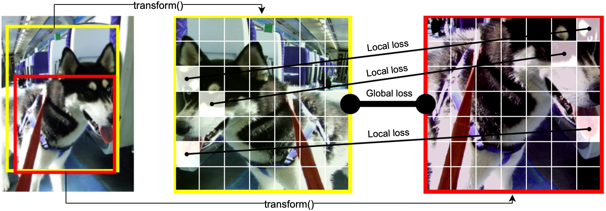

# global-local-self-distillation
This repo contains the code for the WACV 2023 paper [Global-Local Self-Distillation for Visual Representation Learning](https://openaccess.thecvf.com/content/WACV2023/papers/Lebailly_Global-Local_Self-Distillation_for_Visual_Representation_Learning_WACV_2023_paper.pdf).



## Dependencies
* Download [PyTorch](https://pytorch.org/) with cuda (tested with 1.12.0)
* ```pip install xmltodict wandb pandas matplotlib yacs timm pyyaml einops```

## Pretraining
### Single GPU pretraining
Run the [main_global_local_self_distillation.py](main_global_local_self_distillation.py) file. Command line args are defined in [parser.py](my_utils/parser.py).
```bash
python main_global_local_self_distillation.py --arch swin_tiny --data_path some_path --output_dir some_output_path --batch_size_per_gpu 32 --epochs 300 --teacher_temp 0.07 --warmup_epochs 10 --warmup_teacher_temp_epochs 30 --norm_last_layer false --use_dense_prediction True --cfg experiments/imagenet/swin_tiny/swin_tiny_patch4__window7_224.yaml --use_fp16 True --dense_matching_type distance
```

### 1 node pretraining
```bash
python -m torch.distributed.launch --nproc_per_node=8 main_global_local_self_distillation.py --arch swin_tiny --data_path some_path --output_dir some_output_path --batch_size_per_gpu 32 --epochs 300 --teacher_temp 0.07 --warmup_epochs 10 --warmup_teacher_temp_epochs 30 --norm_last_layer false --use_dense_prediction True --cfg experiments/imagenet/swin_tiny/swin_tiny_patch4__window7_224.yaml --use_fp16 True --dense_matching_type distance
```

## Evaluation
Use eval scripts from [EsViT](https://github.com/microsoft/esvit) ([knn](https://github.com/microsoft/esvit/blob/main/eval_knn.py) and [linear](https://github.com/microsoft/esvit/blob/main/eval_linear.py))

## Citation
If you find our work useful, please consider citing:

```
@InProceedings{Lebailly_2023_WACV,
    author    = {Lebailly, Tim and Tuytelaars, Tinne},
    title     = {Global-Local Self-Distillation for Visual Representation Learning},
    booktitle = {Proceedings of the IEEE/CVF Winter Conference on Applications of Computer Vision (WACV)},
    month     = {January},
    year      = {2023},
    pages     = {1441-1450}
}
```

## Acknowledgments

This code is adapted from [EsViT](https://github.com/microsoft/esvit) which is in turn adapted from [DINO](https://github.com/facebookresearch/dino).